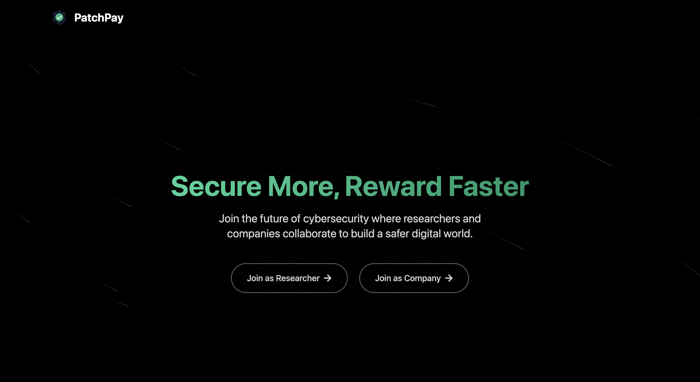

# PatchPay - Bug Bounty Platform



PatchPay is a modern bug bounty platform connecting companies with security researchers to efficiently identify, fix, and reward vulnerability resolutions.

## 🔍 Problem Statement

Companies struggle with efficiently managing and rewarding bug bounty submissions while researchers face inconsistent payment processes. Traditional bug bounty programs often involve complex setup, manual review processes, and unreliable payment methods, creating friction for both parties.

## 💡 Our Solution

PatchPay streamlines the entire bug bounty process with a simple, transparent platform for both companies and security researchers:

- **For Companies**: Post bug details, manage submissions in one place, send rewards hassle free and easily
- **For Researchers**: Find bugs to fix, submit solutions, and receive secure payments instantly

## ✨ Key Features

### For Companies
- **Simple Bug Posting**: Create detailed bug listings with severity and reward information
- **Submission Management**: Review, approve, or reject submitted fixes
- **Secure Payments**: Integrated payment processing with PaymanAI
- **Dashboard Analytics**: Track spending and submission metrics
- **API Key Management**: Securely connect payment services

### For Researchers
- **Bug Discovery**: Browse available bugs filtered by severity and status
- **Solution Submission**: Submit fixes with proof and detailed descriptions
- **GitHub Integration**: Automatically summarize GitHub code in submissions
- **Payment Tracking**: Monitor earnings and submission history
- **Performance Stats**: Track success rates and reputation metrics
- **Leaderboard**: Compete with other researchers

### Platform Features
- **Real-time Notifications**: Stay updated on bug status, submissions, and payments
- **Role-based Access**: Separate workflows for companies and researchers
- **Payman Integration**: Easy and secure payment facilitation

## 💸 PaymanAI Integration

PatchPay integrates with PaymanAI to provide seamless, secure payment processing:

- **Automated Payments**: Trigger payments automatically when fixes are approved
- **Multiple Payment Methods**: Support for various payment options
- **Wallet Management**: Automatic wallet creation and management for researchers
- **Balance Verification**: Verify company balances before accepting bug submissions

### Secure API Key Management

We prioritize security for sensitive payment information:

- **Encrypted Storage**: All PaymanAI API keys are encrypted before storage
- **Environment Variables**: Sensitive keys are never hardcoded
- **Server-side Processing**: Payment operations happen server-side only
- **Scoped Access**: API keys are accessible only to authorized company users


### Company Flow

1. **Registration & Setup**
   - Create a company account
   - Add PaymanAI API key

2. **Bug Management**
   - Post new bug bounties with descriptions and rewards
   - Review submitted solutions
   - Approve solutions and trigger payments

3. **Payment & Reporting**
   - Monitor spending and active bounties
   - Track researcher performance and submission quality

### Researcher Flow

1. **Registration**
   - Create a researcher account
   - Browse available bug bounties

2. **Submission Process**
   - Select bugs to solve
   - Submit fixes with GitHub code summaries
   - Receive notifications on submission status

3. **Payments & Reputation**
   - Get automatic payments when fixes are approved
   - Build reputation through successful submissions
   - Compete on the leaderboard

## 🔧 Tech Stack

### Frontend
- React with Vite
- Tailwind CSS for styling
- React Router for navigation
- Context API for state management
- Axios for API requests

### Backend
- Express.js server
- MongoDB with Mongoose
- JWT authentication
- Bcrypt for password hashing
- Crypto for API key encryption

### Services
- PaymanAI for payment processing
- Gemini AI for GitHub code summarization

## 🚀 Getting Started

### Prerequisites
- Node.js (v16 or higher)
- MongoDB
- PaymanAI account

### Installation

1. Clone the repository:
```bash
git clone https://github.com/yourusername/patchpay.git
cd patchpay
```

2. Install dependencies:
```bash
# Install backend dependencies
cd backend
npm install

# Install frontend dependencies
cd ../frontend
npm install
```

3. Set up environment variables:
```bash
# Backend .env file
cp backend/.env.local backend/.env
# Edit the .env file with your configuration
```

4. Start the development servers:
```bash
# Start backend server
cd backend
npm run dev

# Start frontend server
cd ../frontend
npm run dev
```

## 📈 Future Roadmap

- **Webhook Integrations**: Connect with external tools and services
- **Autopay Approval**: Based on relevance score, automatic payouts
- **Advanced Analytics**: Deeper insights for companies and researchers
- **Team Collaboration**: Support for team-based bug hunting
- **Escrow System**: Enhanced payment protection
- **API Access**: Public API for platform integration

---

Built with ❤️ by the PatchPay Team (Hrishikesh Patil)